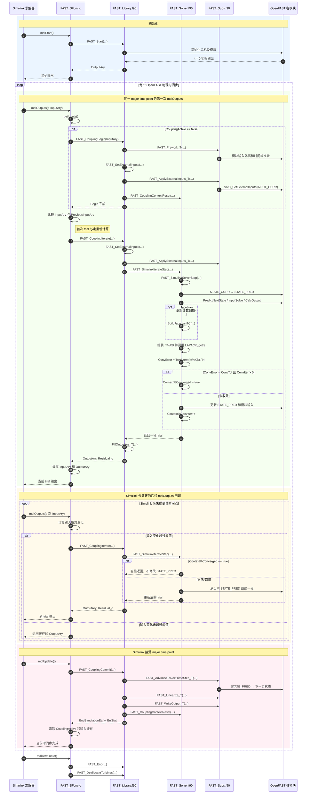

# OpenFAST–Simulink 紧耦合接口修改说明

本文档描述提交 `Feat: Add tightly coupled Simulink iteration interface` 引入的 OpenFAST–Simulink 紧耦合实现。内容以当前仓库代码为准，重点说明接口生命周期、状态所有权、单次迭代行为、收敛与 Jacobian 处理，以及与原生 OpenFAST 通路的隔离关系。

## 1. 修改目标

原 S-function 在 `mdlUpdate` 中调用 `FAST_Update`。一次调用会完成一个完整 OpenFAST 时间步，包括 OpenFAST 内部的预测、修正和收敛循环。Simulink 的代数环求解器无法在同一物理时刻逐次参与 OpenFAST 内部迭代。

本次修改将 Simulink 通路拆分为三个阶段：

```text
FAST_CouplingBegin
        │
        ├── FAST_CouplingIterate  （同一时刻可调用多次）
        ├── FAST_CouplingIterate
        └── ...
        │
FAST_CouplingCommit
```

每次 `FAST_CouplingIterate` 只执行一轮 OpenFAST convergence iteration，并将预测状态保留在 `STATE_PRED`。Simulink 接受当前 major time point 后，`FAST_CouplingCommit` 才把预测状态推进为下一时间步的当前状态。

## 2. 函数调用时序图



图中的两个迭代层次必须区分：

- 外层是 Simulink 代数环求解器对 `mdlOutputs` 的重复调用。
- 每次实际进入 `FAST_CouplingIterate` 时，内层只执行一轮 OpenFAST convergence iteration。
- 输入变化未超过 S-function 阈值，或 OpenFAST 上下文已经收敛时，不会继续修改 `STATE_PRED`。
- 只有 `mdlUpdate` 调用 Commit 后，OpenFAST 才正式接受预测状态并推进物理时间。

## 3. 修改文件

| 文件 | 主要修改 |
|---|---|
| `glue-codes/simulink/src/FAST_SFunc.c` | 将计算从 `mdlUpdate` 移到 `mdlOutputs`，增加 Begin/Iterate/Commit 调用、回调计数和输入变化缓存 |
| `glue-codes/simulink/src/create_FAST_SFunc.m` | 更新链接库名称 |
| `modules/openfast-library/src/FAST_Library.h` | 声明三个紧耦合 C API |
| `modules/openfast-library/src/FAST_Library.f90` | 实现紧耦合 C API并维护每台风机的耦合上下文 |
| `modules/openfast-library/src/FAST_Solver.f90` | 新增 Simulink 专用单轮求解器，原生 `FAST_SolverStep` 保持独立 |
| `modules/openfast-library/src/FAST_Subs.f90` | 新增当前 ServoDyn 输入槽的外部输入刷新函数 |

## 4. C API

### 4.1 `FAST_CouplingBegin`

```c
void FAST_CouplingBegin(
    int *iTurb,
    int *NumInputs,
    double *InputAry,
    int *ErrStat,
    char *ErrMsg);
```

该函数开始一个新的物理时间步，主要执行：

1. 检查风机编号、输入数组长度和当前是否已有活动步骤。
2. 调用一次 `FAST_Prework_T`，完成原 OpenFAST 时间步开始阶段的输入外插等工作。
3. 调用 `FAST_SetExternalInputs` 保存当前 Simulink 控制输入。
4. 调用 `FAST_ApplyExternalInputs_T`，把最新外部控制量写入 ServoDyn 的 `INPUT_CURR`。
5. 重置 `FAST_CouplingContext`，然后设置 `Begun=.TRUE.`。

`FAST_Prework_T` 只在 Begin 阶段执行一次，不会在同一时间步的每次 trial 中重复外插。

### 4.2 `FAST_CouplingIterate`

```c
void FAST_CouplingIterate(
    int *iTurb,
    int *NumInputs,
    int *NumOutputs,
    double *InputAry,
    double *OutputAry,
    double *Residual,
    int *ErrStat,
    char *ErrMsg);
```

每次调用执行：

1. 更新外部控制输入。
2. 直接刷新 ServoDyn 当前输入槽。
3. 调用 `FAST_SimulinkIterateStep`。
4. 返回当前 trial 的 OpenFAST 输出。
5. 通过 `Residual` 返回 OpenFAST 内部的 `ConvError`。

如果上下文已经标记为 `Converged`，`FAST_SimulinkIterateStep` 直接返回，不再修改预测状态；随后仍由 `FillOutputAry_T` 返回已经保存的输出。

### 4.3 `FAST_CouplingCommit`

```c
void FAST_CouplingCommit(
    int *iTurb,
    bool *EndSimulationEarly,
    int *ErrStat,
    char *ErrMsg);
```

Commit 在 Simulink 接受 major time point 后执行：

1. 调用 `FAST_AdvanceToNextTimeStep_T`，提交 `STATE_PRED`。
2. 增加 OpenFAST 全局时间步计数。
3. 执行线性化和文件输出。
4. 返回提前结束标志。
5. 重置耦合上下文。

当前 Commit 只检查是否已经 Begin，不要求 `Converged=.TRUE.`。因此最终是否接受当前 trial 由 Simulink 时间步接受过程决定。

## 5. 耦合上下文

每台风机分配一个 `FAST_CouplingContext`：

```fortran
type :: FAST_CouplingContext
   logical :: Begun = .false.
   logical :: Active = .false.
   logical :: Converged = .false.
   integer(IntKi) :: ConvIter = 0
   integer(IntKi) :: NumUJac = 0
   real(R8Ki) :: ConvError = 0.0_R8Ki
end type FAST_CouplingContext
```

字段含义：

| 字段 | 含义 |
|---|---|
| `Begun` | Begin 已执行，允许 Iterate 或 Commit |
| `Active` | 本物理步的第一次 trial 初始化已执行，后续调用从现有 `STATE_PRED` 继续 |
| `Converged` | OpenFAST 内部残差已满足收敛条件，后续 Iterate 跳过求解 |
| `ConvIter` | 当前物理步累计执行的 convergence iteration 数量 |
| `NumUJac` | 当前物理步 Jacobian 重建次数 |
| `ConvError` | 最近一次 OpenFAST Newton 修正量的平均二范数 |

实际 trial 状态没有复制到 Context 中，而是继续存放在 OpenFAST 原有数据结构中，例如：

- `m%StatePred`
- 各模块的 `STATE_PRED`
- `m%Mod%Lin%u`
- `m%Mod%Lin%x`
- 已分解的 Jacobian 和 `m%IPIV`

因此 Context 只保存控制信息和诊断量，不保存大型模块状态副本。

## 6. Simulink 专用求解器

### 6.1 与原生求解器隔离

新增入口为：

```fortran
FAST_SimulinkSolverStep(...)
```

原生 OpenFAST 仍调用：

```fortran
FAST_SolverStep(...)
```

Simulink 通路没有通过可选参数或模式分支进入原生 `FAST_SolverStep`。因此不使用 Simulink 接口时，原 OpenFAST 的 correction loop、convergence loop、错误处理和时间步推进过程不经过新增代码。

### 6.2 第一次 trial

当 `Context%Active=.FALSE.` 时，专用求解器执行时间步预测初始化：

1. `m%UJacStepsRemain` 减一。
2. 重置 mapping-ready 标志。
3. 将 `StateCurr` 复制到 `StatePred`。
4. 将各紧耦合模块的 `STATE_CURR` 复制到 `STATE_PRED`。
5. 执行 ElastoDyn 方位角和桨距角预测调整。
6. 执行 BeamDyn 加速度传递与全局参考系更新。
7. 调用 `PredictNextState`。
8. 完成 Option 2、Option 1 和 tight-coupling 模块的首次输入求解与状态更新。
9. 保存当前线性化输入向量。

完成后设置 `Context%Active=.TRUE.`。

### 6.3 后续 trial

后续调用不会从 `STATE_CURR` 重新预测，而是直接使用上一轮留下的：

```text
STATE_PRED + m%Mod%Lin%u + 已分解 Jacobian
```

每次调用完成一轮：

1. 计算模块输出。
2. 计算紧耦合状态导数。
3. 使用 `INPUT_TEMP` 求解模块输入。
4. 组装残差右端项 `m%XB`。
5. 必要时构建 Jacobian。
6. 用 `LAPACK_getrs` 求解 Newton 修正量。
7. 检查收敛。
8. 未收敛时更新预测状态和模块输入。
9. 增加 `Context%ConvIter` 并返回。

函数内部虽然保留 `do` 结构，但每次调用最多执行一轮，末尾立即 `return`。迭代次数由多次 `mdlOutputs` 回调驱动。

## 7. Jacobian 处理

Simulink 专用求解器沿用 OpenFAST 的两个计数器：

```fortran
m%UJacIterRemain
m%UJacStepsRemain
```

每轮 trial 将 `UJacIterRemain` 减一。当任一计数器小于等于零时：

```fortran
call BuildJacobianTC(...)
```

`BuildJacobianTC` 会重新构建并分解 Jacobian，同时重置更新计数器。没有触发更新时，后续 trial 继续使用同一个已分解 Jacobian。

`Context%NumUJac` 记录本时间步实际重建次数，并写入 `DriverWriteOutput(3)`。

## 8. OpenFAST 内部残差与收敛

内部 Newton 修正量存放在 `m%XB(:,1)`，残差定义为：

```fortran
Context%ConvError = TwoNorm(m%XB(:,1)) / size(m%XB)
```

即：

\[
e_{OF}=\frac{\|\Delta X\|_2}{N}
\]

其中 `m%XB` 同时包含紧耦合状态修正和模块输入修正，并对载荷分量应用 OpenFAST 原有的条件缩放。

当前收敛条件为：

```fortran
Context%ConvIter > 0 .and. Context%ConvError < p%ConvTol
```

满足后设置 `Converged=.TRUE.`，保存诊断输出并返回。下一次同一时间步的 Iterate 会跳过 OpenFAST 求解。

需要注意：当前 Simulink 专用函数中的 `MaxConvIter` 检查处于注释状态，因此专用通路不会因达到 `p%MaxConvIter` 自动终止；迭代次数实际还受到 Simulink 代数环求解器的回调行为和 S-function 输入缓存策略影响。

## 9. OpenFAST 残差与 Simulink 代数环残差的区别

`Residual_c` 是 OpenFAST 内部 Newton 修正残差，不是 Simulink 代数环求解器的方程残差。

Simulink 对环变量 `z` 求解：

\[
r_{SL}(z)=F(z)-z=0
\]

而 OpenFAST 返回：

\[
e_{OF}=\|\Delta X_{OF}\|_2/N
\]

两者可以相互影响，但不等价。Simulink 不会因为 C API 返回了 `Residual_c` 就自动将其用作内部收敛判据。

当前 `FAST_SFunc.c` 仍配置为一个输出端口：

```c
ssSetNumOutputPorts(S, 1);
```

因此 `CouplingResidual` 当前只保存在 S-function 静态变量中并用于调试输出，没有作为独立的 Simulink 输出端口暴露。

## 10. S-function 执行过程

### 10.1 `mdlStart`

`mdlStart` 调用 `FAST_Start`，获得初始 OpenFAST 输出，并重置：

- `CouplingActive`
- `AlgLoopCount`
- `CouplingResidual`
- 输入缓存状态

### 10.2 `mdlOutputs`

输入端口设置为 direct feedthrough：

```c
ssSetInputPortDirectFeedThrough(S, 0, 1);
```

在 major time step、采样命中且 `t>0` 时：

1. 从端口读取 `InputAry`。
2. 如果尚未 Begin，调用 `FAST_CouplingBegin`。
3. 比较当前输入与上一次实际计算时缓存的输入。
4. 只有输入变化超过阈值时才调用 `FAST_CouplingIterate`。
5. 未重新计算时继续返回缓存的 `OutputAry`。

当前代码的逐元素重算条件是：

```c
fabs(InputAry[i] - PreviousInputAry[i]) /
    (fabs(InputAry[i]) + 1e-10) > 1e-5
```

任一元素满足条件即重新计算。首次 trial 因 `PreviousInputValid=false` 必定计算。

该判据是 S-function 的性能节流策略，不是 Simulink 内部代数环残差判据。接近零的输入由于分母使用 `1e-10`，会非常敏感；不同量纲的输入也没有独立绝对容差。

### 10.3 `mdlUpdate`

`mdlUpdate` 只负责接受步骤：

```c
FAST_CouplingCommit(...)
```

它不再调用 `FAST_Update`，也不额外执行 convergence iteration。Commit 后清除活动标志和输入缓存，并增加 S-function 的全局步计数。

### 10.4 `mdlTerminate`

终止时调用 `FAST_End` 和 `FAST_DeallocateTurbines`，并重置 S-function 静态状态。

## 11. ServoDyn 外部输入刷新

`FAST_Prework_T` 会对模块输入执行一次时间外插。Simulink 在同一时刻给出新的 trial 控制输入时，不应重复整个 Prework，否则会重复执行与物理时间步相关的准备过程。

新增：

```fortran
FAST_ApplyExternalInputs_T(Turbine)
```

该过程仅针对 ServoDyn 调用：

```fortran
SrvD_SetExternalInputs(..., SrvD%Input(INPUT_CURR,i))
```

因此：

- Begin：先 Prework，再覆盖当前外部输入。
- Iterate：只覆盖当前外部输入，不重复 Prework。

## 12. BeamDyn 处理

第一次 trial 初始化 BeamDyn预测状态时，会执行：

```fortran
SetBDAccel(..., OtherSt(STATE_PRED))
BD_UpdateGlobalRef(...)
GetBDAccel(..., StatePred)
```

这是因为 BeamDyn 加速度和 generalized-alpha 算法变量存放在 `OtherSt%acc` 与 `OtherSt%xcc`，不完全包含在普通连续状态 `x` 中。

在每轮 Newton 修正末尾，当前代码与原生 `FAST_SolverStep` 一致，没有再次调用下面的同步：

```fortran
! call SetBDAccel(..., OtherSt(STATE_PRED))
```

这样避免每轮外部修正都覆盖 BeamDyn 自己维护的算法加速度状态。

## 13. 当前限制

1. **没有 Rollback API**：若 Simulink 放弃某个 major time point，当前接口没有显式恢复已修改 `STATE_PRED` 的入口。
2. **Commit 不强制收敛**：Simulink 接受步骤时，即使 `Context%Converged` 为假也可提交。
3. **MaxConvIter 未启用**：专用通路的最大内部迭代检查当前被注释。
4. **残差未形成独立端口**：C API 已返回残差，但 S-function 当前仍只有一个输出端口。
5. **输入缓存是静态全局数据**：当前 S-function 设计仍以单风机、单实例为主要使用方式。
6. **输入变化不等于代数环残差**：相邻两次 `InputAry` 的变化只能作为是否重算的启发式条件。
7. **阈值量纲敏感**：当前逐元素相对变化公式在输入接近零时可能触发大量重算。

## 14. 构建与验证

修改后的 Fortran 文件可使用 Intel oneAPI `ifx` 和现有 Matlab Release 模块目录进行单元编译检查。S-function 可使用 MATLAB MEX编译：

```powershell
$env:MATLAB_PREFDIR = (Resolve-Path 'build\sfunc-verify\matlab-prefs')
& 'C:\Program Files\MATLAB\R2026a\bin\mex.bat' `
  -c `
  -outdir build\sfunc-verify `
  '-Imodules\openfast-library\src' `
  '-Imodules\externalinflow\src' `
  '-Imodules\extloads\src' `
  glue-codes\simulink\src\FAST_SFunc.c
```

完整运行仍需要链接与 `create_FAST_SFunc.m` 中一致的 OpenFAST Simulink 库，并在实际 Simulink 模型中检查：

- 同一物理时刻 `mdlOutputs` 的调用次数；
- `InputAry` trial 序列；
- OpenFAST `ConvError`；
- Jacobian 重建次数；
- `mdlUpdate` 是否只在接受时间点调用；
- BeamDyn 旋转矩阵和预测状态是否保持有效。

## 15. 生命周期总结

```text
初始化
  FAST_Start
      │
每个物理时间步
  mdlOutputs: FAST_CouplingBegin
      │
      ├─ 输入变化足够大 → FAST_CouplingIterate → 更新 STATE_PRED
      ├─ 输入变化不足   → 返回缓存输出
      ├─ OpenFAST 收敛   → 后续 Iterate 跳过内部求解
      └─ Simulink 继续求解其代数环
      │
  mdlUpdate: FAST_CouplingCommit
      │
      └─ STATE_PRED → 下一时间步状态，写输出并重置 Context
```

核心原则是：OpenFAST 只维护自身预测状态和内部 Newton 迭代；Simulink 决定同一时刻调用多少次输出函数以及何时接受时间点；原生 OpenFAST 求解器保持独立。
